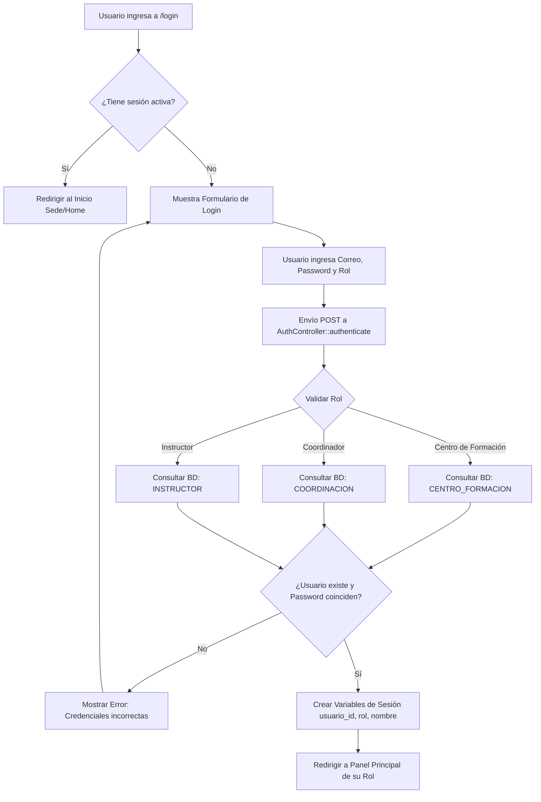
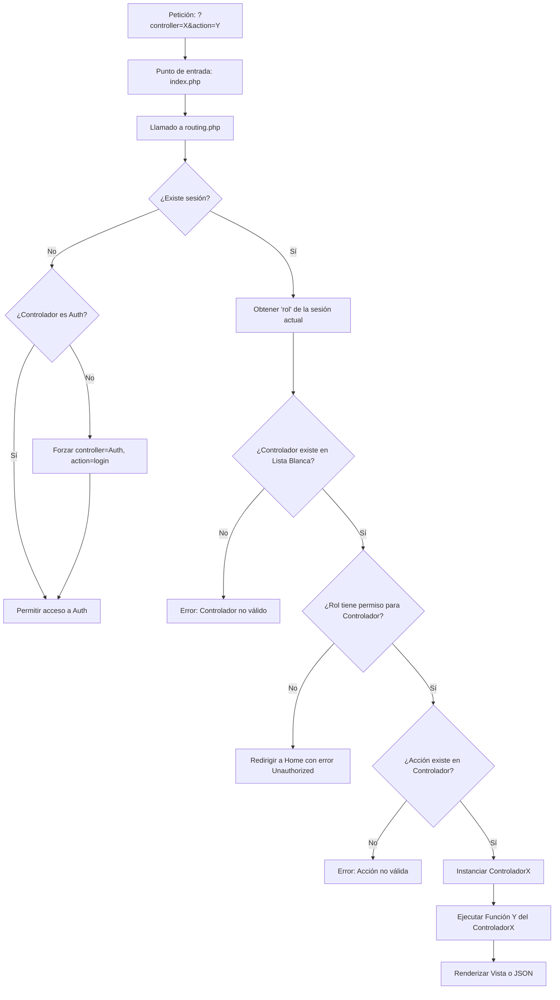
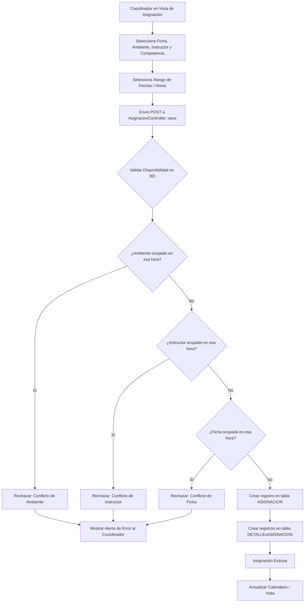

# Diagramas de Flujo del Sistema

A continuación, se presentan los diagramas de flujo principales del **Sistema de Gestión de Ambientes SENA**, describiendo los procesos clave de autenticación, enrutamiento (RBAC) y la lógica de asignación.

## 1. Flujo de Autenticación (Login)

Este diagrama muestra cómo el sistema valida las credenciales y redirige a los usuarios según su rol.

## 2. Flujo de Enrutamiento y Control de Acceso (RBAC)

Este diagrama explica cómo el archivo `routing.php` protege cada vista y controlador del sistema basándose en el rol del usuario conectado.

## 3. Flujo Principal de Asignación de Ambientes

Este es el proceso "Core" del sistema donde un Coordinador asigna un horario a un instructor, grupo y ambiente, evitando colisiones.

